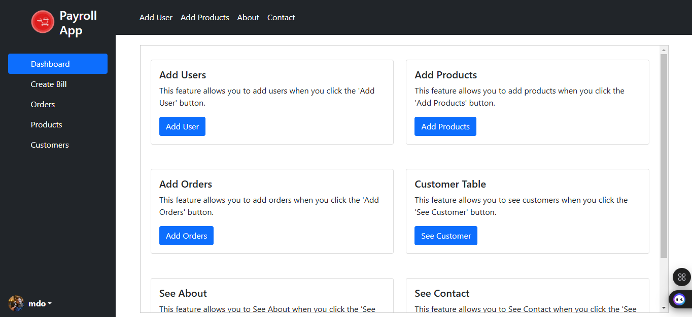
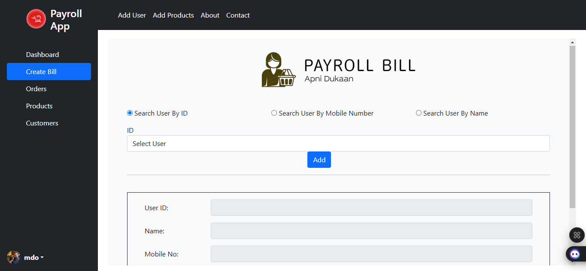
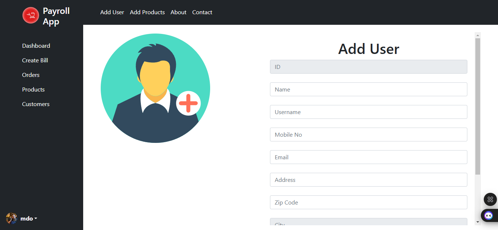
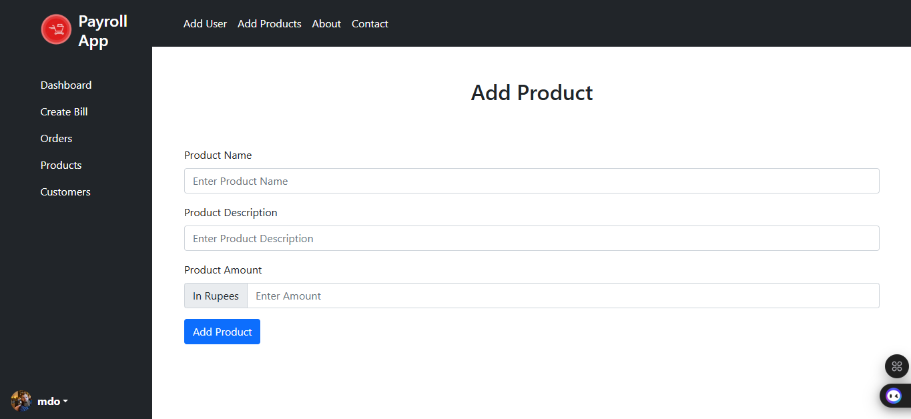
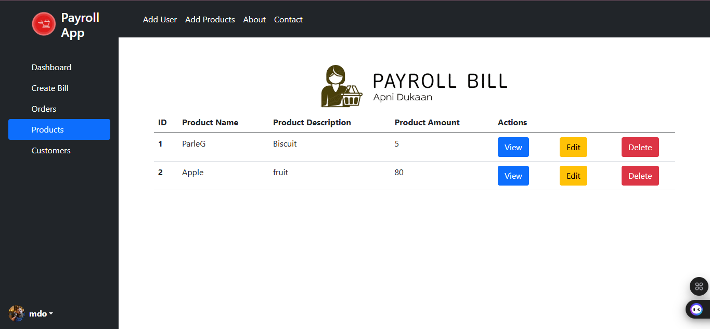
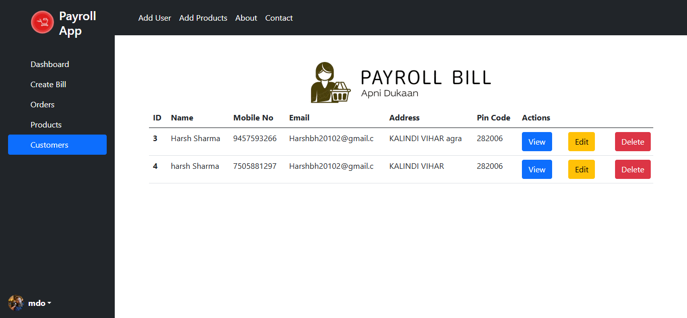
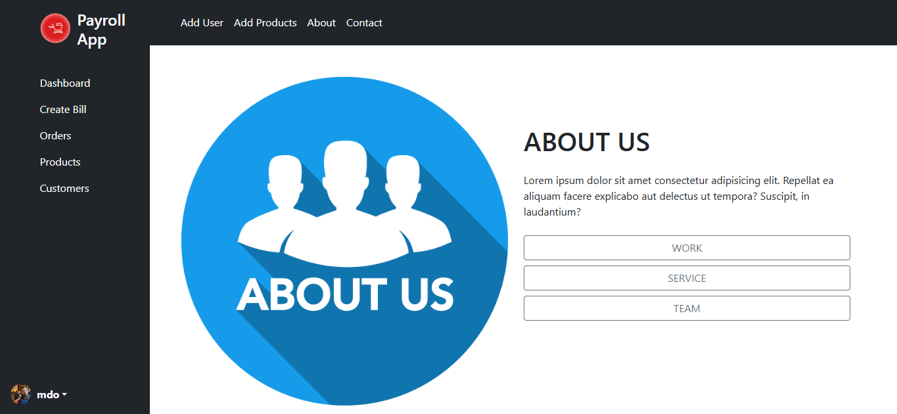
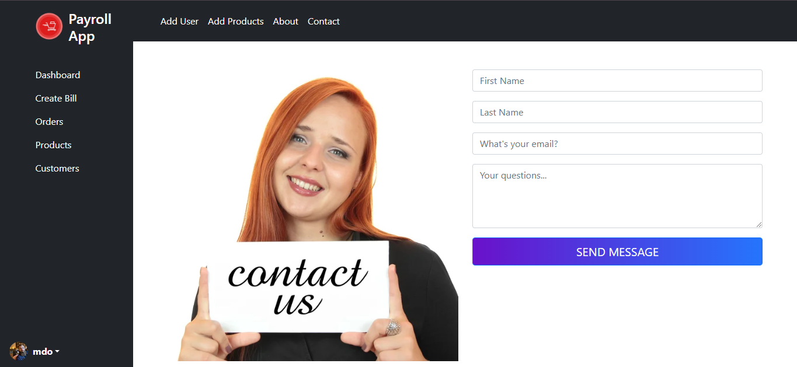

# 🏪 Payroll System


> **A simple 💰 billing & sales management system for a 🛍️ shopkeeper to manage transactions efficiently.**

## 📌 Features
- 🛒 **Billing System** - Generate 🧾 bills for customer purchases.
- 📦 **Product Management** - ➕ Add, 📝 update, and ❌ delete products.
- 👥 **Customer & User Management** - Maintain records of customers.
- 📜 **No Authentication** - Designed for a single shopkeeper (🔑 no login required).
- 🎨 **User-Friendly UI** - Built with 🎨 Bootstrap & 🔔 SweetAlert for a seamless experience.

## 🛠️ Technologies Used
- 🐘 **PHP** - Backend processing  
- 🛢 **MySQL** - Database management  
- 🎨 **Bootstrap** - Responsive UI design  
- 🎭 **CSS & HTML** - Frontend styling & structure  
- ⚡ **JavaScript** - Client-side functionalities  
- 🔔 **SweetAlert** - User-friendly popups  
- 🔄 **POST API** - Data handling  

## 📸 Screenshots

### 🖥️ Dashboard  


### 🛒 Billing Page  


### ➕ Add User  


### ➕ Add Products  


### 📜 Product List  


### 🧑‍🤝‍🧑 Users/Customer List  


### ℹ️ About Page  


### 📞 Contact Page  


## 🗄️ Database Schema

### 🏦 **Creating the Database**
```sql
CREATE DATABASE payroll_db;
USE payroll_db;
```

### 👥 **Users Table**
```sql
CREATE TABLE users (
    id INT AUTO_INCREMENT PRIMARY KEY,
    name VARCHAR(255) NOT NULL,
    username VARCHAR(255) NOT NULL UNIQUE,
    mobile_no VARCHAR(15),
    email VARCHAR(255) UNIQUE,
    address TEXT,
    pincode VARCHAR(10),
    city VARCHAR(100),
    state VARCHAR(100)
);
```

### 📦 **Products Table**
```sql
CREATE TABLE products (
    id INT AUTO_INCREMENT PRIMARY KEY,
    productName VARCHAR(255) NOT NULL,
    productDescription TEXT,
    productAmount DECIMAL(10,2) NOT NULL
);
```

### 🛍 **Orders Table**
```sql
CREATE TABLE orders (
    sr_no INT AUTO_INCREMENT PRIMARY KEY,
    user_id INT,
    user_name VARCHAR(255),
    user_mobile VARCHAR(15),
    date_of_purchasing DATE,
    time_of_purchasing TIME,
    total_amount DECIMAL(10,2),
    FOREIGN KEY (user_id) REFERENCES users(id) ON DELETE CASCADE
);
```

## 🚀 Installation & Setup

1️⃣ **Clone the repository:**
   ```sh
   git clone https://github.com/your-repo/payroll.git
   ```

2️⃣ **Import the database:**
   - Open **phpMyAdmin**
   - Create a new database (e.g., `payroll_db`)
   - Import `database/payroll.sql`

3️⃣ **Configure Database Connection:**
   - Edit `config.php`
   - Set the database credentials:
     ```php
     $host = 'localhost';
     $user = 'root';
     $password = '';
     $database = 'payroll_db';
     ```

4️⃣ **Start the project:**
   - Run a local server using XAMPP/WAMP
   - Open the browser and go to:  
     🔗 `http://localhost/payroll`

## 🔮 Future Enhancements
- ✅ **User Authentication** - Multi-user access & security 🔐  
- 📧 **Email Notifications** - Auto-send bills to customers 📩  
- 📈 **Advanced Reports** - Charts & analytics for better insights 📊  
- 💳 **Payment Gateway Integration** - Accept online payments 💵  

## 📞 Contact  
📧 Email: [your-email@example.com](mailto:your-email@example.com)  

🌟 **Like the project? Give it a ⭐ on GitHub!** 🚀

